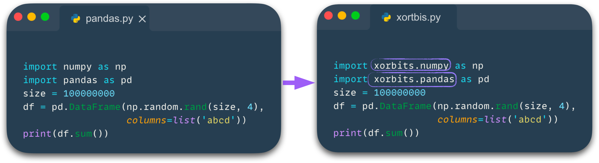
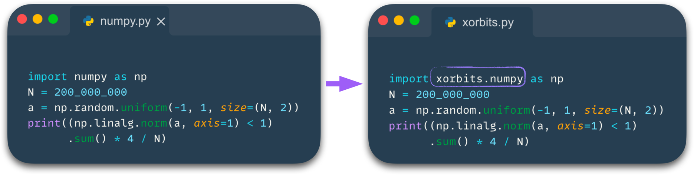
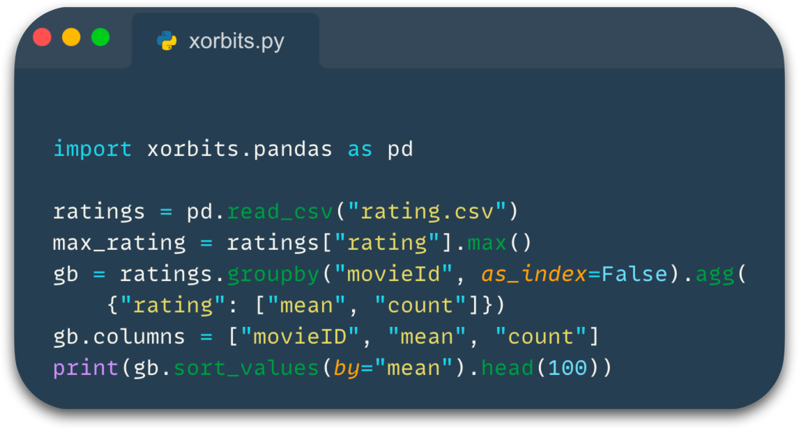
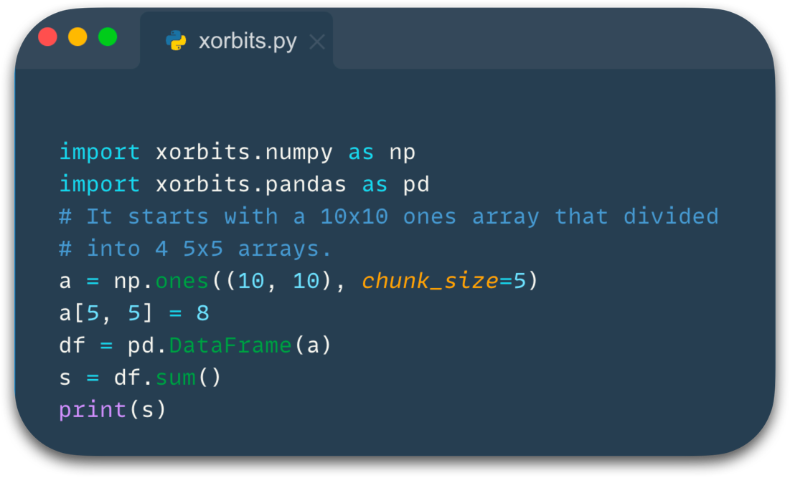
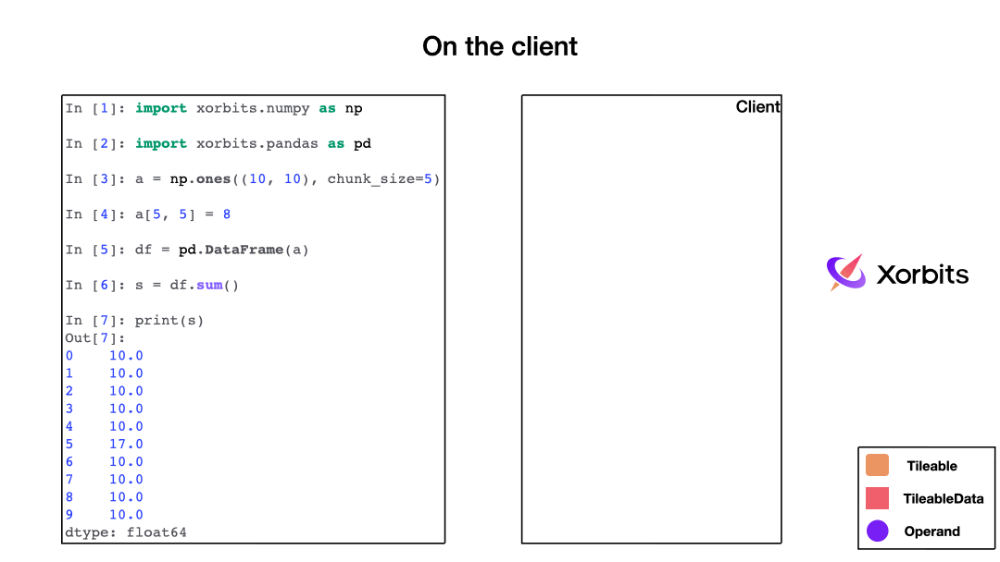
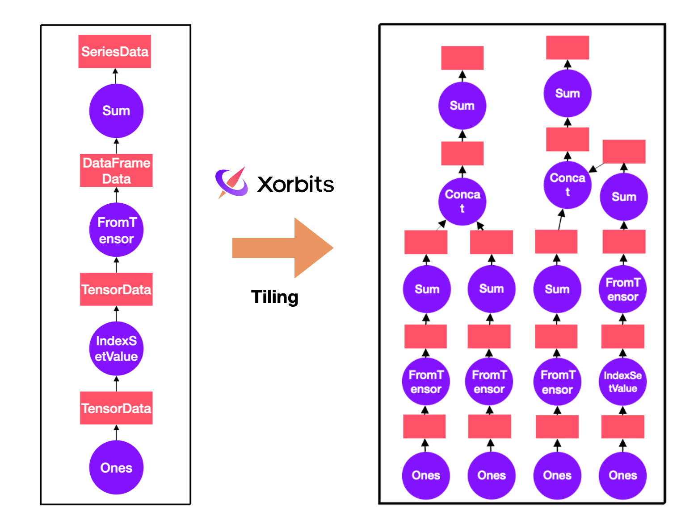
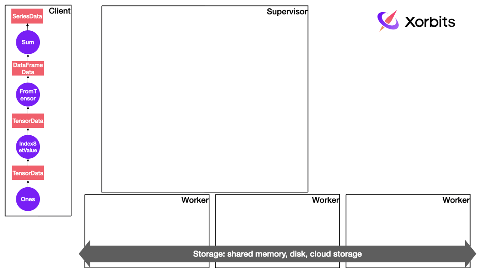
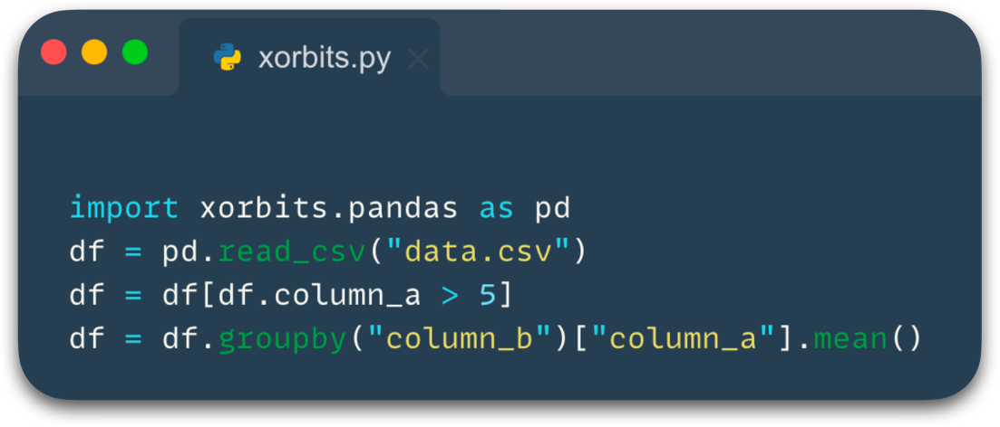
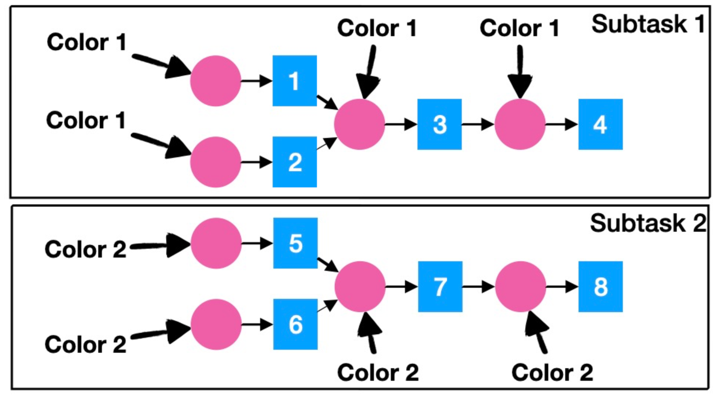

# Xorbits Internals - Part1: Why Xorbits is the best choice of data analysis

In the world of data science, Pandas is the most popular and widely used Python library for data science,
Numpy is the fundamental package for scientific computing with Python and Scikit-learn is the most useful and 
robust library for machine learning in Python. However, as the amount of data continues to grow, 
it becomes increasingly difficult for data scientists to process millions or billions of data using these libraries,
especially when data volume exceeds the memory capacity of a single machine. Xorbits was created to address this challenge,
providing a solution for scaling and accelerating data science workloads, including, but not limited to, those 
utilizing the aforementioned libraries.

This series of blog posts will explain why Xorbits is special and how Xorbits works. As the first in this series,
this article provides the overview of Xorbits internals and designs.

## Easy to use
This is the first thing to be considered when Xorbits was created. The user communities of Pandas, Numpy and 
Scikit-learn have proved that easy-to-use is one of the most important things of making a choice, Xorbits has put 
many efforts in boosting your Python code at the least cost.

### Compatible with existing ecosystem
Users would know how to use Xorbits as long as you know how to use Numpy, Pandas and so forth. Xorbits APIs are
compatible with existing data science libraries, data engineers don't have to learn new knowledge, and it becomes
so seamless to scale your Pandas or Numpy codes.

Compare with Pandas:

Compare with Numpy:

From local validation on a small scale to analysis on a large scale, Xorbits doesn't need to rewrite your Python code or
translate it into other languages like SQL, it makes you focus on data itself not on tools.

Here are Xorbits APIs implemented or planned include:

| API                                                                            | Implemented version or plan |
|--------------------------------------------------------------------------------|-----------------------------|
| [xorbits.pandas](https://doc.xorbits.io/en/latest/reference/pandas/index.html) | v0.1.0                      |
| [xorbits.numpy](https://doc.xorbits.io/en/latest/reference/numpy/index.html)   | v0.1.0                      |
| xorbits.sklearn                                                                | Planned in the near future  |
| xorbits.xgboost                                                                | Planned in the near future  |
| xorbits.lightgbm                                                               | Planned in the near future  |
| xorbits.xarray                                                                 | Planned in the future       |

### Deferred evaluation
Eager evaluation or lazy evaluation is always a hard choice for any computing framework. From a performance perspective,
lazy evaluation is a better choice because it allows for more optimizations, but it requires the users to explicitly 
specify when to trigger execution. In comparison, eager mode is more intuitive for users and is consistent with 
the behavior of existing libraries including Numpy and Pandas. So Xorbits chooses deferred mode, it delays the 
evaluation until its value is needed, but does not require user's specification. Xorbits will determine when the 
operation is needed by the user and execute at the appropriate time.

Consider the following code, not all variables are executed.

Xorbits will only execute the last expression and print it, the variable `max_rating` will not be computed because it
has no relation to the final result, and all intermediate variables will not be stored either. Deferred execution can
greatly improve performance and reduce memory usage without changing user's code. More information can be found
in the documentation at [here](https://doc.xorbits.io/en/latest/user_guide/deferred_execution.html#deferred-execution). 

## How Xorbits parallelize computation
Although Xorbits behaves like Numpy or Pandas, the implementations behind the APIs are rewritten in parallel manners.

Xorbits uses a divide-and-conquer strategy to run tasks in parallel, the execution mainly consists of three steps:

1. On the client side, a computation graph is constructed.
2. On the supervisor, the graph is divided into small execution units, which are called chunks in Xorbits.
3. The Xorbits supervisor distributes tasks to workers through the fine-grained graph.

Let's take a look at how this code runs in Xorbits.

### Building computation graph
When you call a function, Xorbits builds a computation graph in the background, with each function corresponding 
to different operators.

As the animation shows, the computation graph constructed describes the entire computation process and when Xorbits 
determines that it needs to be executed, it sends the computation graph to the supervisor.

### Dividing into chunks
When the computation graph is sent to the supervisor, there is a series of processing, where one of the most 
important step is to divide the computation graph into sub-graphs, which can be executed. This process 
is called tiling in Xorbits. During the tiling, Xorbits will divide the computation graph based on 
the size of data or some specified hint. In this example, the original data is divided into four small chunks 
and each of them becomes a separate subtask, allowing for parallel computation.

Looking at the fine-grained graph on the right, you can notice that operators like "setvalues" only affects a subset 
of data, and only appear in the computation flow of one of the chunks during tiling.

### Distributing subtasks
After the task is divided into subtasks, the most important step is to distribute all subtasks to the workers for
execution. Xorbits takes several factors into consideration during scheduling. Firstly, Xorbits adopts a depth-first 
strategy, it can release intermediate results as early as possible and reduce memory usage during the 
computation. Secondly, Xorbits schedules based on locality to minimize data transfer between the workers. 
For some special operators, Xorbits can also accept some customized scheduling policies. These ensure Xorbits 
can perform the computation in the most optimal way possible.

This animation shows the complete flow of execution in Xorbits, the details will be introduced in the next section or 
the following series of articles.

## Why Xorbits so fast

Xorbits performs well in [benchmarks](https://xorbits.io/benchmark). In addition to the parallelism and scheduling 
strategies mentioned above, Xorbits has made a lot of optimizations throughout the entire execution process. 
These optimizations enable us to lead other frameworks.

### Graph optimization
Based on the computation graph, Xorbits can perform some optimizations on the execution plan before actual computation.
A series of optimization rules such as column pruning, predicate pushing and operator fusion can make the computation
faster and use less memory. Before tiling, Xorbits optimizer will try to optimize the coarse-grained graph, such 
optimization will have a significant benefit on large-scale datasets.

Dynamic column pruning is one of the most effective optimizations. Xorbits optimizer will keep the columns 
that each operator depends on, when it encounters operators such as join, groupby, and others that may cause a large
amount of data exchange or datasource operators such as read_csv, read_parquet, the optimizer will prune the
unnecessary columns, in some scenarios the amount of computation can be reduced by an order of magnitude.

Here's a simple example:

By traversing backwards from the final operator "groupby" and using the information recorded by the optimizer, it can be 
determined that only the "column_a" and "column_b" columns are needed for the final result. So it will only read 
these two columns from the file, which can reduce memory usage and computation time, even if it can not push down 
to the datasource operator, it also reduces the amount of data in intermediate steps.

### Fusion
In addition to optimizing the execution plan, graph fusion is also a very important step. When dealing with large
amounts of data, the generated fine-grained graph's nodes will be very numerous and the topological 
structure of the graph will become very complex. At this point, graph fusion can simplify the problem and make it 
more efficient.

Xorbits proposes a fusion algorithm based on coloring. First, assign different initial colors to the nodes according
to the bands that assigned by assigner, then propagate the colors through both a forward and backward traversal. 
Finally, merge the nodes with the same color into a single subgraph.

As shown in the picture, the operations 1 and 2 are colored with 1, and operations 5 and 6 are colored with 2. 
Then the colors propagate in topological order; operation 3 receives only one type of color, so it is also colored 
with 1, and the same applies to operation 4.

Propagating in reverse topological order does not affect the color of the nodes.

Finally, the entire graph is only colored with two colors, and nodes with the same color can be fused, resulting 
in two subtasks. Graph fusion not only reduces scheduling overhead, but also provides more possibilities for 
runtime optimization.

### Iterative tiling and others
In addition to the above optimizations, Xorbits has made efforts in various aspects. Iterative tiling allows Xorbits 
to have an adaptive tiling strategy, making tiling more flexible and intelligent, allowing Xorbits to dynamically adjust 
the data partitioning based on the runtime load. Support for arrow dtype allows Xorbits to have an advantage in 
handling strings. Xorbits can utilize GPU acceleration for data processing and is also trying to optimize 
communication overhead. All of these make Xorbits stand out among these data science libraries, making it 
the best choice for your data analysis.

## Conclusion
I hope this blog has given you a basic understanding of Xorbits, the following articles in this series will delve 
deeper into the implementation details of each component. If it has inspired you,
[getting started](https://doc.xorbits.io/en/latest/getting_started/index.html) and having fun!

